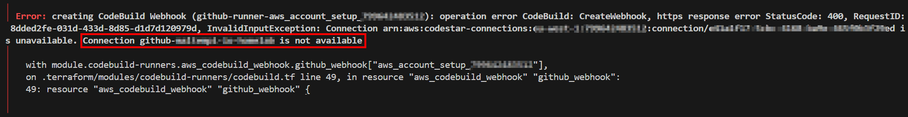
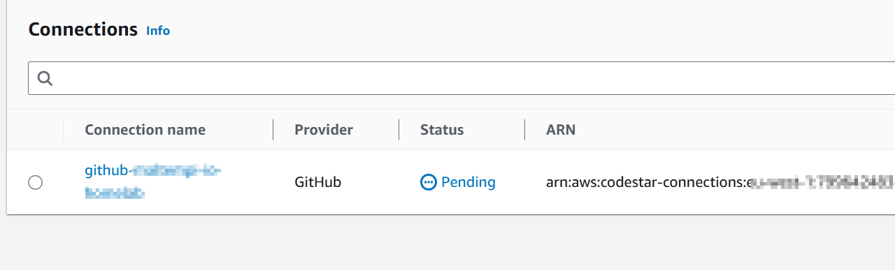
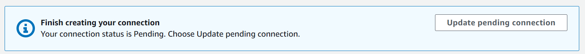
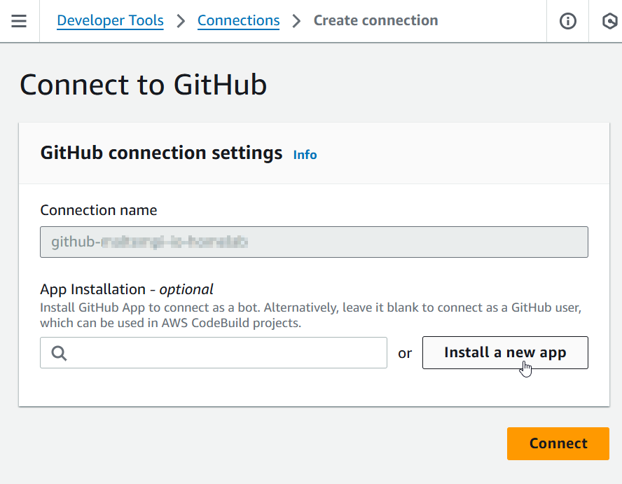
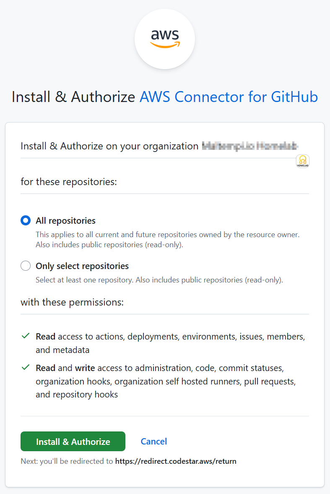
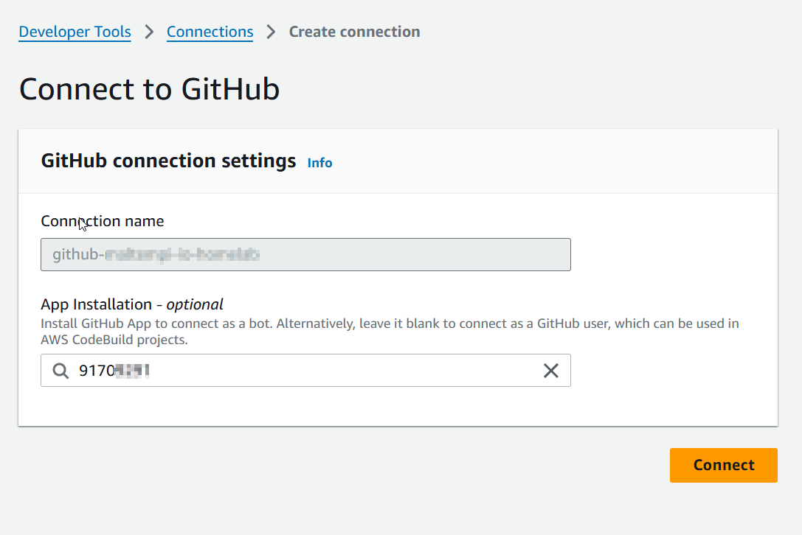
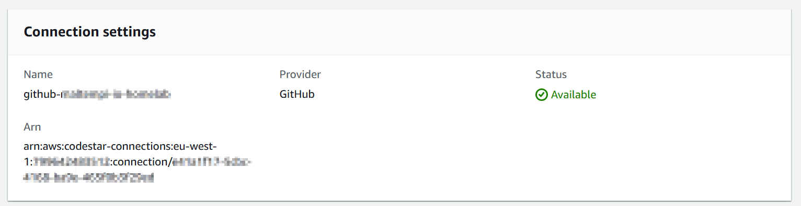
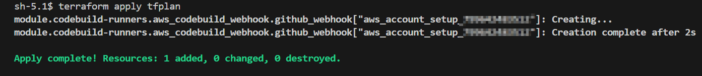

# Creating a CodeStar Connection

After deploying the module, the CodeStar connection will be in a **pending** state. You must manually authorize it through the AWS Console to allow CodeBuild to access your GitHub repositories.

## Step 1: Initial Deployment May Fail

When you first run your GitHub Actions workflow, it will fail because the connection hasn't been authorized yet. This is expected.

## Step 2: Navigate to Connections

Go to **AWS Console > Developer Tools > Settings > Connections**. You'll see your connection listed with a "Pending" status.

## Step 3: Update the Pending Connection

Click on the pending connection, then click **Update pending connection** to start the authorization process.

## Step 4: Install GitHub App

You'll be prompted to install the AWS Connector for GitHub app. Click **Install a new app** to proceed.

## Step 5: Authorize GitHub Access

Select the GitHub organization or account where your repositories are located. You can grant access to all repositories or select specific ones.

## Step 6: Create the Connection

After authorization, click **Connect** to complete the connection setup.

## Step 7: Connection Established

The connection status should now show as **Available**. Your CodeBuild projects can now access your GitHub repositories.

## Step 8: Re-run the Workflow

Go back to your GitHub repository and re-run the failed workflow. It should now complete successfully.

## Troubleshooting

- **Connection stays pending**: Ensure you have admin access to the GitHub organization
- **Workflow still fails**: Check that the repository name in your `runners` configuration matches exactly
- **Permission denied**: Verify the GitHub App has access to the specific repository
